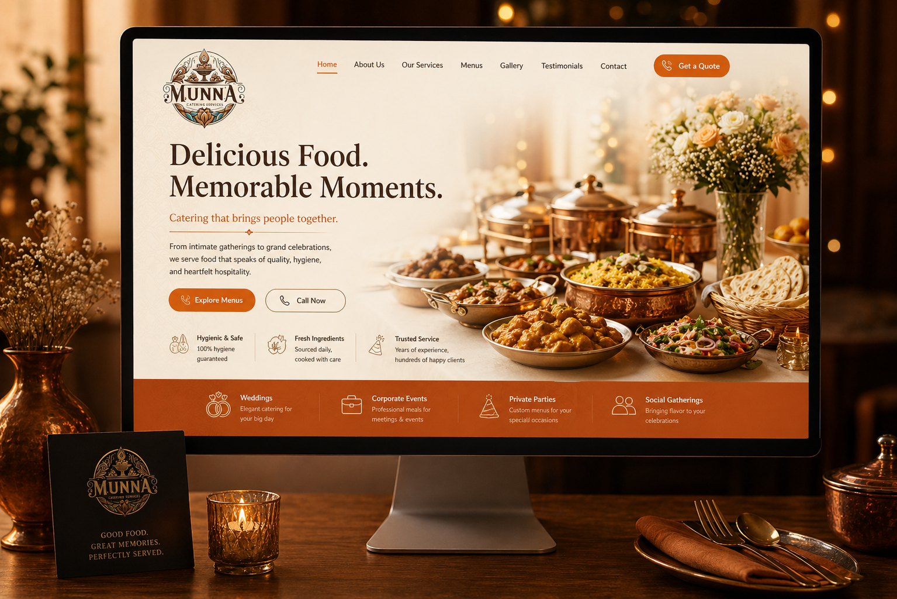

<div align="center">

# Munna Catering Services

### *Good food. Memorable occasions. Done right.*

[](https://github.com/TheAlgo7/munna-catering-frontend)
[](https://github.com/TheAlgo7/munna-catering-frontend)
[](https://thealgothrim.com)

</div>



A real business needed a real website — one that earns trust before a visitor reads a single word. Munna Catering Services is a static client site built to present a catering brand with warmth, credibility, and a clear path to contact. Food-forward visuals, clean service layout, and a direct inquiry flow — nothing clever, everything useful.

## Project Brief

**Client:** Munna Catering Services
**Goal:** Establish a digital presence that makes the business look established, trustworthy, and easy to hire.
**What it does:** Showcases service categories and event support, builds appetite appeal through imagery, and drives bookings through prominent contact surfaces.

## What the Site Covers

- **Services** — Catering categories across weddings, corporate events, private parties, and social gatherings
- **Menu showcase** — Food-forward presentation with hygiene and freshness as trust signals
- **Crockery & event support** — Broader offering beyond just food, increasing booking value
- **Gallery** — Visual storytelling that makes the business feel tangible before first contact
- **Testimonials** — Social proof for new visitors
- **Contact & inquiry** — Direct call-to-action and booking entry point

## Stack

| Layer | Technology |
| --- | --- |
| Frontend | HTML, CSS, Vanilla JavaScript |
| Build | Babel |
| Output | Static deployable frontend |

<details>
<summary>Quick Start</summary>

```bash
git clone https://github.com/TheAlgo7/munna-catering-frontend.git
cd munna-catering-frontend
python -m http.server 8000
```

Open `http://localhost:8000`. Alternatively:

```bash
npx serve .
```

For the JavaScript build output:

```bash
npm install
npm run build
```

</details>

<div align="center">

Built for a **real business, real customers, and real conversion** — by **[The Algothrim](https://thealgothrim.com)**

</div>
