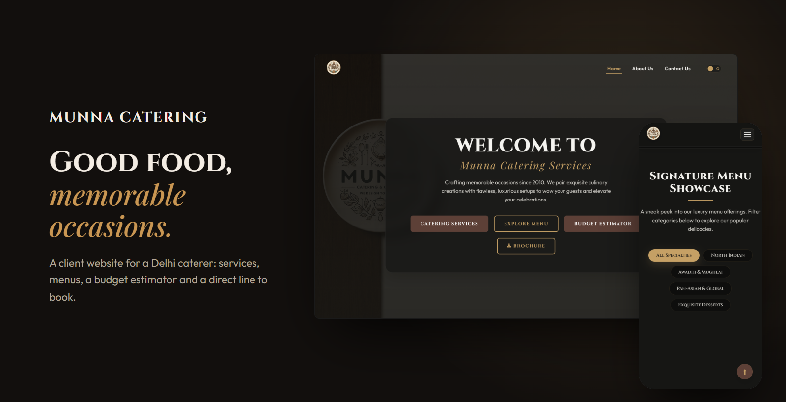
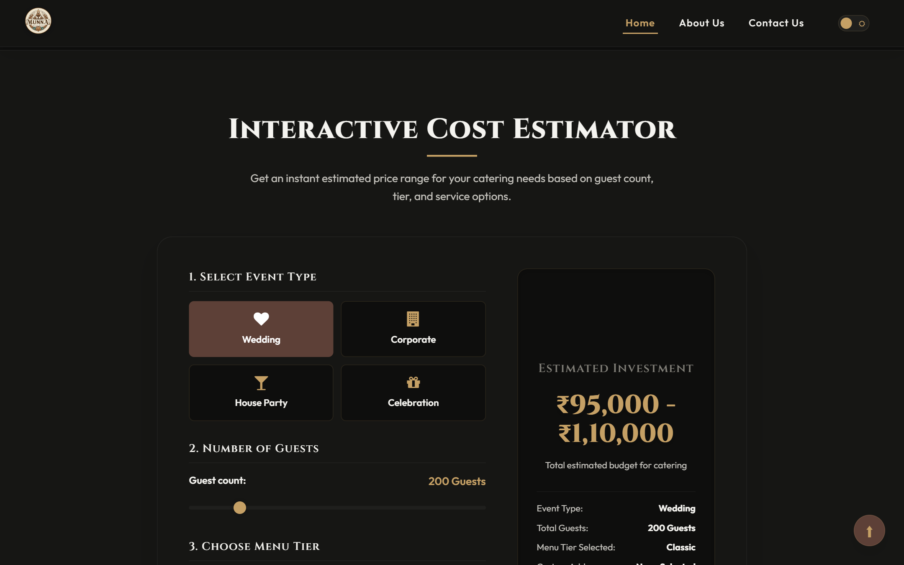
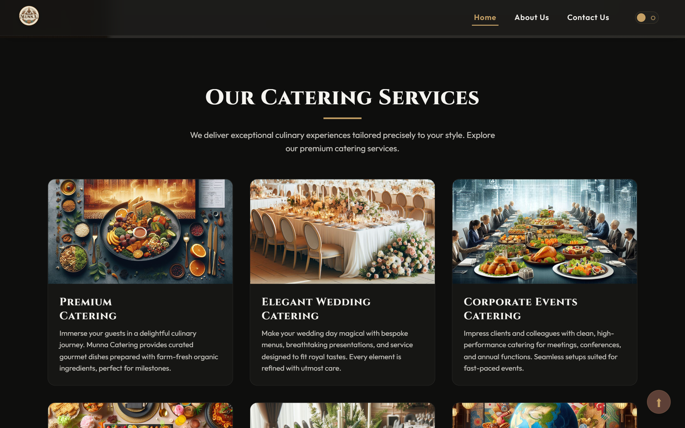
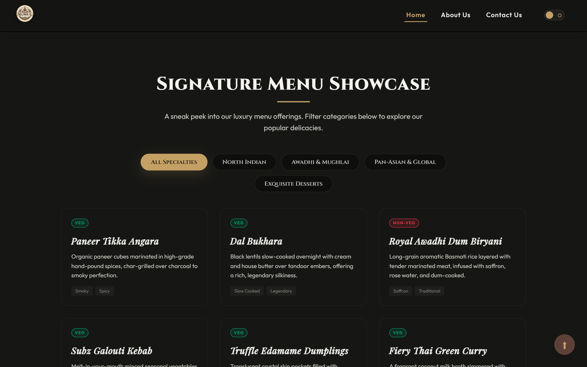
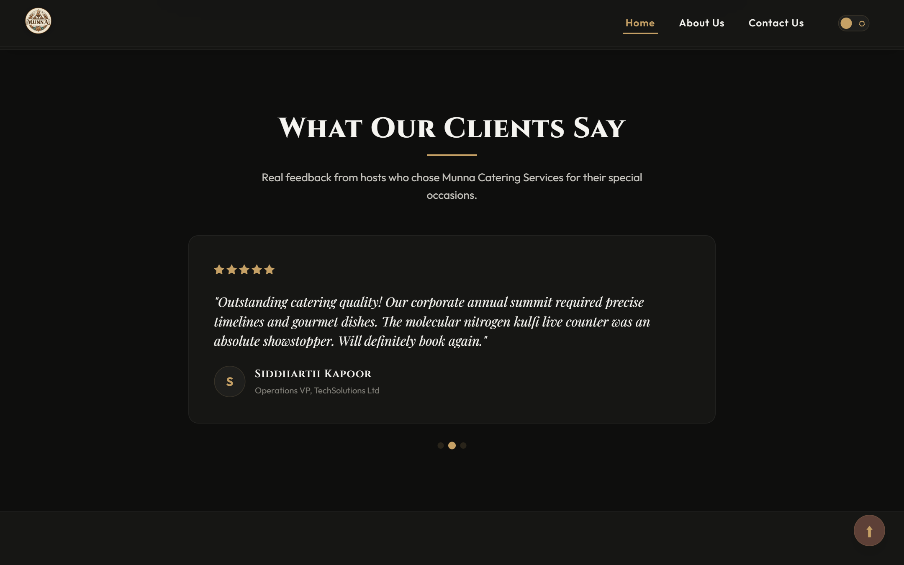
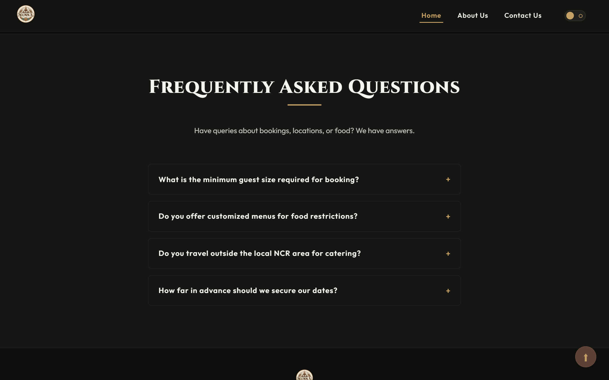
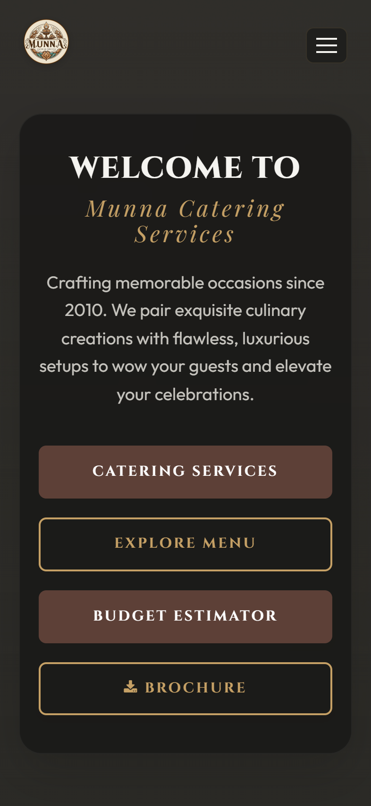
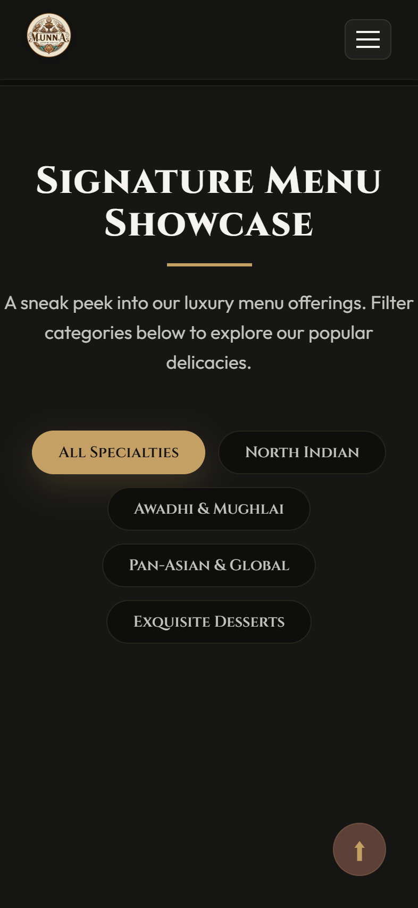
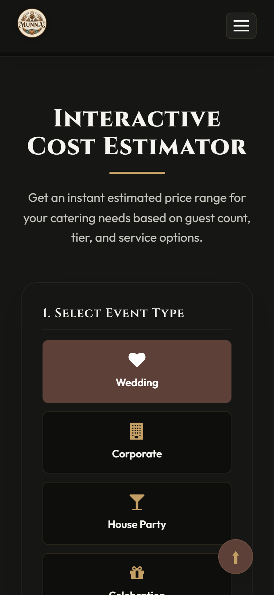

<p align="center">
  
</p>

<p align="center">
  <strong>A website for Munna Catering Services, a Delhi caterer for weddings, corporate events and house parties since 2010.</strong><br>
  Services, a filterable menu, an instant cost estimator and a direct path to booking.
</p>

<p align="center">
  <a href="#what-the-site-covers">What it covers</a>
  &nbsp;·&nbsp;
  <a href="#how-it-works">How it works</a>
  &nbsp;·&nbsp;
  <a href="#run-it-locally">Run it locally</a>
</p>

<p align="center">
  
  
  
</p>

## The brief

A real business needed to look established online, earn trust before anyone read a word, and make hiring it easy. So the site leads with food and occasions, keeps the services clear, and puts a way to call or enquire on every screen. Its most useful piece is the cost estimator: a visitor picks the event, the guest count and a menu tier and sees a price range before they ever pick up the phone.

The site is no longer hosted. This repository keeps it, and it runs from any static server.

## Screenshots

<p align="center">
  
</p>

<table>
  <tr>
    <td align="center"><br><sub>Services</sub></td>
    <td align="center"><br><sub>The signature menu</sub></td>
  </tr>
  <tr>
    <td align="center"><br><sub>What clients said</sub></td>
    <td align="center"><br><sub>Common questions</sub></td>
  </tr>
</table>

<p align="center">
  
  &nbsp;&nbsp;
  
  &nbsp;&nbsp;
  
</p>

## What the site covers

- **Services** for weddings, corporate events, private parties and celebrations.
- **A signature menu** filterable by North Indian, Awadhi and Mughlai, Pan-Asian and global, and desserts, each dish marked veg or non-veg.
- **Crockery and event support** beyond the food itself.
- **An interactive cost estimator** that turns event type, guests, menu tier and add-ons into a price range, then carries the choices into the contact form.
- **A downloadable brochure** of the full menu.
- **Testimonials and FAQs** for the questions every client asks.
- **Dark and light themes**, remembered on the device.

## How it works

- **Static pages.** `index.html`, `html/about.html` and `html/contact.html`, one stylesheet, and `js/script.js` for the theme, the menu filter and the estimator.
- **Estimator to enquiry.** The estimate is saved in `localStorage` when the visitor moves to Contact, so the form arrives filled in with their event.
- **Reveal on scroll.** Sections animate in as they enter the viewport.
- **Build.** Babel compiles `js/` into `dist/js/` for older browsers.

## Run it locally

```bash
git clone https://github.com/TheAlgo7/munna-catering-frontend.git
cd munna-catering-frontend
python -m http.server 8124
```

Open http://localhost:8124. With that server running, `python scripts/readme-shots.py` rebuilds the screenshots in this README.

## Licence

Copyright © 2026 Gaurav Kumar, [The Algothrim](https://thealgothrim.com), for Munna Catering Services. All rights reserved.
